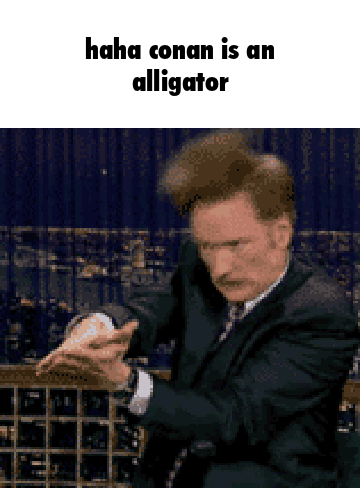

# Gif captioner

Makes a gif with text above it like on iFunny

Turns images like this:


Into this:



also includes a speech bubble meme generator as well

# Using 

```
python captiongif.py [-i INPUT] string`
```


requires:
```
pillow
```


Bash script usage:
Put all of the gifs you want to caption into a folder called `gifs`, the script will display each gif in the terminal using sixel and then let you write a caption. Use case is so you can rapid fire captioning for maximum funny.

bash script requires:
```
libsixel
```


please report an issue if you find any weird edge cases with the resizing and text getting cut off

 
